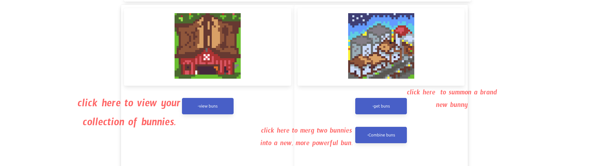
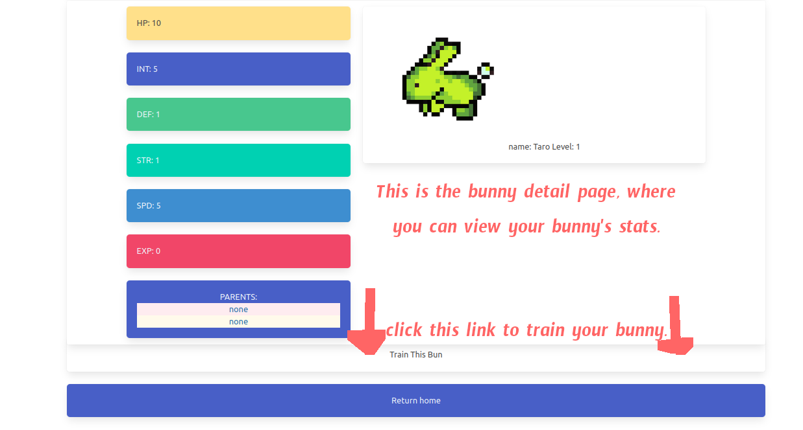
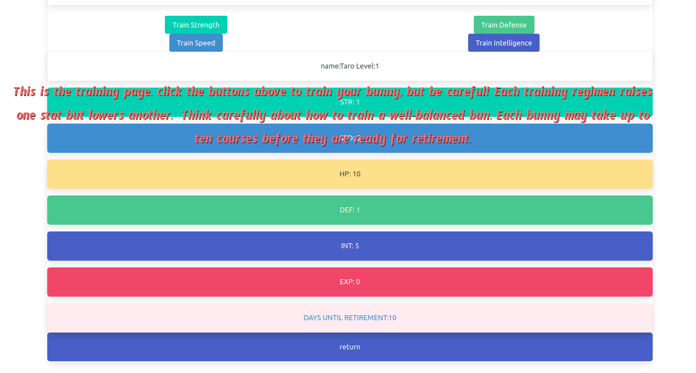
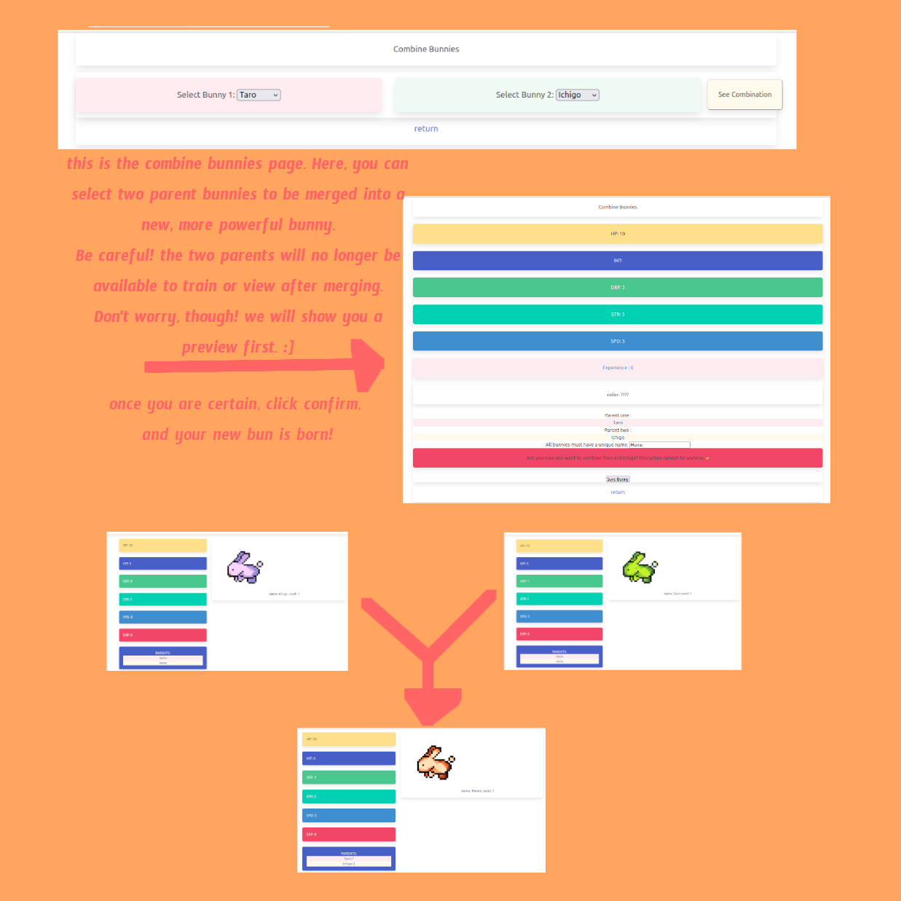

# WELCOME TO BUNNYRANCHER
built with django, css using the Bulma framework.
Bunny rancher is a game about raising the strongest Bunnies in the land. Acquire, train, and merge Bunnies to become the top trainer!

